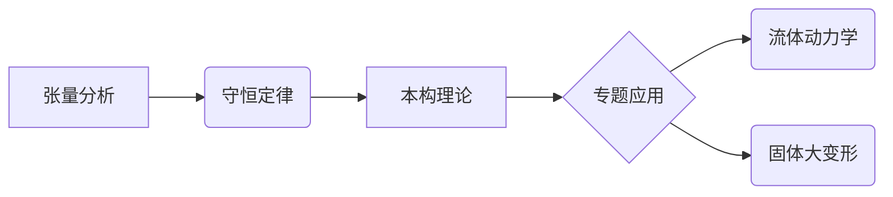

# 连续介质力学课程笔记

📚 **课程名称**：连续介质力学  
👨 **授课教师**：赵亚溥 研究员/教授  
🏛 **所属机构**：中国科学院力学研究所  

---

## 课程简介

《连续介质力学》是力学、物理、材料科学和工程学科的核心基础课程，系统研究宏观尺度下物质运动和变形的普适性规律。赵亚溥老师的课程以深厚的理论功底和学科前沿视角，贯通经典力学框架与现代交叉应用，培养从连续介质角度建模和分析复杂物理现象的能力。

---

## 知识图谱

## 致谢

特别感谢赵亚溥老师深入浅出的讲授，课程完美展现了连续介质力学作为"力学大一统理论"的魅力。
---

⭐ **欢迎Star/Fork**  
如需引用笔记内容，请注明来源。期待与同道者共同完善这份知识图谱！
