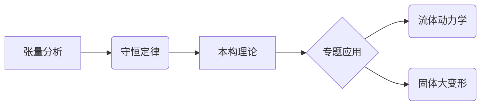

# 连续介质力学课程笔记

📚 **课程名称**：连续介质力学  
👨 **授课教师**：赵亚溥 研究员/教授  
🏛 **所属机构**：中国科学院力学研究所  

---

## 课程简介

《连续介质力学》是力学、物理、材料科学和工程学科的核心基础课程，系统研究宏观尺度下物质运动和变形的普适性规律。赵亚溥老师的课程以深厚的理论功底和学科前沿视角，贯通经典力学框架与现代交叉应用，培养从连续介质角度建模和分析复杂物理现象的能力。

---

## 知识图谱

```mermaid
graph LR
A[张量分析] --> B(守恒定律)
B --> C[本构理论]
C --> D{专题应用}
D --> E1(流体动力学)
D --> E2(固体大变形)
```
